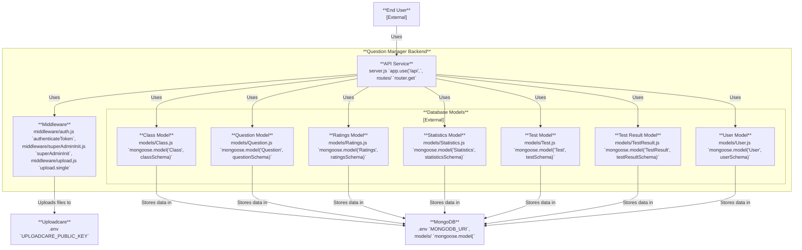

# Unnamed CodeViz Diagram

```mermaid
graph TD

    base.cv::endUser["**End User**<br>[External]"]
    base.cv::mongoDb["**MongoDB**<br>.env `MONGODB_URI`, models/ `mongoose.model(`"]
    base.cv::uploadcare["**Uploadcare**<br>.env `UPLOADCARE_PUBLIC_KEY`"]
    subgraph base.cv::questionManagerBackend["**Question Manager Backend**<br>[External]"]
        base.cv::api["**API Service**<br>server.js `app.use('/api',`, routes/ `router.get`"]
        base.cv::middleware["**Middleware**<br>middleware/auth.js `authenticateToken`, middleware/superAdminInit.js `superAdminInit`, middleware/upload.js `upload.single`"]
        subgraph base.cv::databaseModels["**Database Models**<br>[External]"]
            base.cv::classModel["**Class Model**<br>models/Class.js `mongoose.model('Class', classSchema)`"]
            base.cv::questionModel["**Question Model**<br>models/Question.js `mongoose.model('Question', questionSchema)`"]
            base.cv::ratingsModel["**Ratings Model**<br>models/Ratings.js `mongoose.model('Ratings', ratingsSchema)`"]
            base.cv::statisticsModel["**Statistics Model**<br>models/Statistics.js `mongoose.model('Statistics', statisticsSchema)`"]
            base.cv::testModel["**Test Model**<br>models/Test.js `mongoose.model('Test', testSchema)`"]
            base.cv::testResultModel["**Test Result Model**<br>models/TestResult.js `mongoose.model('TestResult', testResultSchema)`"]
            base.cv::userModel["**User Model**<br>models/User.js `mongoose.model('User', userSchema)`"]
        end
        %% Edges at this level (grouped by source)
        base.cv::api["**API Service**<br>server.js `app.use('/api',`, routes/ `router.get`"] -->|"Uses"| base.cv::middleware["**Middleware**<br>middleware/auth.js `authenticateToken`, middleware/superAdminInit.js `superAdminInit`, middleware/upload.js `upload.single`"]
        base.cv::api["**API Service**<br>server.js `app.use('/api',`, routes/ `router.get`"] -->|"Uses"| base.cv::classModel["**Class Model**<br>models/Class.js `mongoose.model('Class', classSchema)`"]
        base.cv::api["**API Service**<br>server.js `app.use('/api',`, routes/ `router.get`"] -->|"Uses"| base.cv::questionModel["**Question Model**<br>models/Question.js `mongoose.model('Question', questionSchema)`"]
        base.cv::api["**API Service**<br>server.js `app.use('/api',`, routes/ `router.get`"] -->|"Uses"| base.cv::ratingsModel["**Ratings Model**<br>models/Ratings.js `mongoose.model('Ratings', ratingsSchema)`"]
        base.cv::api["**API Service**<br>server.js `app.use('/api',`, routes/ `router.get`"] -->|"Uses"| base.cv::statisticsModel["**Statistics Model**<br>models/Statistics.js `mongoose.model('Statistics', statisticsSchema)`"]
        base.cv::api["**API Service**<br>server.js `app.use('/api',`, routes/ `router.get`"] -->|"Uses"| base.cv::testModel["**Test Model**<br>models/Test.js `mongoose.model('Test', testSchema)`"]
        base.cv::api["**API Service**<br>server.js `app.use('/api',`, routes/ `router.get`"] -->|"Uses"| base.cv::testResultModel["**Test Result Model**<br>models/TestResult.js `mongoose.model('TestResult', testResultSchema)`"]
        base.cv::api["**API Service**<br>server.js `app.use('/api',`, routes/ `router.get`"] -->|"Uses"| base.cv::userModel["**User Model**<br>models/User.js `mongoose.model('User', userSchema)`"]
    end
    %% Edges at this level (grouped by source)
    base.cv::endUser["**End User**<br>[External]"] -->|"Uses"| base.cv::api["**API Service**<br>server.js `app.use('/api',`, routes/ `router.get`"]
    base.cv::classModel["**Class Model**<br>models/Class.js `mongoose.model('Class', classSchema)`"] -->|"Stores data in"| base.cv::mongoDb["**MongoDB**<br>.env `MONGODB_URI`, models/ `mongoose.model(`"]
    base.cv::questionModel["**Question Model**<br>models/Question.js `mongoose.model('Question', questionSchema)`"] -->|"Stores data in"| base.cv::mongoDb["**MongoDB**<br>.env `MONGODB_URI`, models/ `mongoose.model(`"]
    base.cv::ratingsModel["**Ratings Model**<br>models/Ratings.js `mongoose.model('Ratings', ratingsSchema)`"] -->|"Stores data in"| base.cv::mongoDb["**MongoDB**<br>.env `MONGODB_URI`, models/ `mongoose.model(`"]
    base.cv::statisticsModel["**Statistics Model**<br>models/Statistics.js `mongoose.model('Statistics', statisticsSchema)`"] -->|"Stores data in"| base.cv::mongoDb["**MongoDB**<br>.env `MONGODB_URI`, models/ `mongoose.model(`"]
    base.cv::testModel["**Test Model**<br>models/Test.js `mongoose.model('Test', testSchema)`"] -->|"Stores data in"| base.cv::mongoDb["**MongoDB**<br>.env `MONGODB_URI`, models/ `mongoose.model(`"]
    base.cv::testResultModel["**Test Result Model**<br>models/TestResult.js `mongoose.model('TestResult', testResultSchema)`"] -->|"Stores data in"| base.cv::mongoDb["**MongoDB**<br>.env `MONGODB_URI`, models/ `mongoose.model(`"]
    base.cv::userModel["**User Model**<br>models/User.js `mongoose.model('User', userSchema)`"] -->|"Stores data in"| base.cv::mongoDb["**MongoDB**<br>.env `MONGODB_URI`, models/ `mongoose.model(`"]
    base.cv::middleware["**Middleware**<br>middleware/auth.js `authenticateToken`, middleware/superAdminInit.js `superAdminInit`, middleware/upload.js `upload.single`"] -->|"Uploads files to"| base.cv::uploadcare["**Uploadcare**<br>.env `UPLOADCARE_PUBLIC_KEY`"]

```
---
*Generated by [CodeViz.ai](https://codeviz.ai) on 12/7/2025, 5:56:47 PM*
